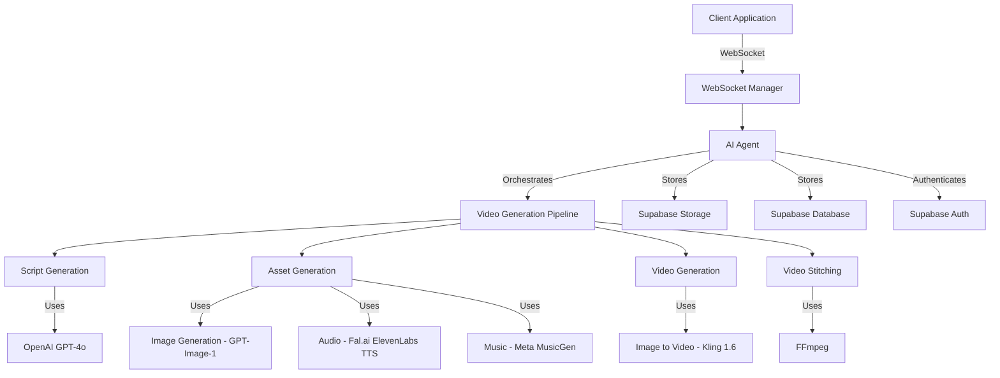
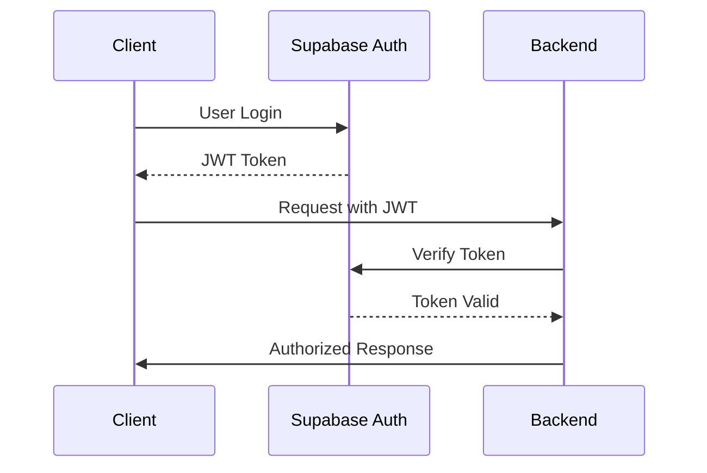

# Pixora AI Video Creation Platform - Implementation Plan

## 1. System Architecture Overview



## 2. Core Components

### 2.1 WebSocket-Based Chat Interface

The primary interface will be a WebSocket-based chat experience where users interact with an AI agent:

- **Split-Screen UI**: Left side shows the chat with the AI agent, right side shows the video creation process
- **Conversational Flow**: The agent guides users through the entire process, from prompt analysis to final video
- **Task-Based System**: Each video generation creates a task with a unique ID that's used throughout the process
- **Real-Time Updates**: Progress updates are sent through the WebSocket connection

### 2.2 AI Agent Capabilities

The AI agent will:

1. **Analyze Prompts**: Understand user requests and generate appropriate responses
2. **Generate Scripts**: Break down prompts into scenes with appropriate durations (5s or 10s)
3. **Manage Asset Generation**: Coordinate the generation of images, audio, and music
4. **Handle Editing Requests**: Process requests to regenerate specific components
5. **Provide Explanations**: Explain the video creation process and answer questions

### 2.3 Video Generation Pipeline

The pipeline consists of these stages:

1. **Script Generation & Scene Breakdown**
   - Takes user prompt, video config (ratio, style, duration)
   - Uses GPT-4o to create detailed script with scene breakdown
   - Ensures scenes are optimized for 5s or 10s clips (hard constraint)
   - Handles character consistency requirements
   - Automatically determines which scenes should share the same music

2. **Parallel Asset Generation**
   - Character images (if character consistency is enabled)
     - Either uses user-provided image as reference
     - Or generates a profile image first, then uses it as reference
   - Scene images for each clip
   - Voice-over audio using Fal.ai ElevenLabs TTS API
   - Background music for groups of scenes

3. **Video Creation**
   - Generates motion videos from static images (5s or 10s clips)
   - Synchronizes with audio durations
   - Applies transitions between scenes
   - Stitches everything together with background music

### 2.4 Storage System

We'll use Supabase Storage with this specific structure:

```
pixora/
  └── <prompt[:10]_taskid>/
        ├── scene1/
        │     ├── video.mp4
        │     └── audio.mp3
        ├── scene2/
        │     ├── video.mp4
        │     └── audio.mp3
        ├── ...
        ├── music/
        │     ├── clip_1_2_3.mp3
        │     └── clip_4_5.mp3
        ├── fullvideo.mp4
        └── script.json
```

Additionally, we'll store component-wise URLs in the database for easy retrieval and management.

## 3. Supabase Integration

We'll use Supabase for database, authentication, and storage:

### 3.1 Authentication Flow

While the client will handle most of the authentication process, we'll need to implement a token exchange endpoint in our backend:



### 3.2 Token Exchange Endpoint

We'll add a dedicated endpoint for token exchange:

```python
@app.post("/api/v1/auth/token")
async def exchange_token(
    request: TokenExchangeRequest,
    response: Response
):
    """
    Exchange a Supabase JWT token for a session token.
    This allows the client to authenticate with our WebSocket connections.
    """
    try:
        # Verify the Supabase token
        user_data = await verify_supabase_token(request.token)
        
        # Create a session token for WebSocket authentication
        session_token = create_session_token(user_data)
        
        return {
            "session_token": session_token,
            "expires_at": get_expiry_timestamp(session_token)
        }
    except Exception as e:
        logger.error(f"Token exchange error: {str(e)}")
        response.status_code = status.HTTP_401_UNAUTHORIZED
        return {"error": "Invalid token"}
```

### 3.3 Database Schema (Supabase)

```sql
-- Users table (managed by Supabase Auth, referenced here for completeness)
-- This table is automatically created and managed by Supabase Auth
-- We'll reference the 'id' column from this table

-- Tasks table
CREATE TABLE tasks (
  id TEXT PRIMARY KEY,
  user_id UUID NOT NULL REFERENCES auth.users(id),
  prompt TEXT NOT NULL,
  status TEXT NOT NULL,
  created_at TIMESTAMP WITH TIME ZONE NOT NULL DEFAULT NOW(),
  updated_at TIMESTAMP WITH TIME ZONE NOT NULL DEFAULT NOW()
);

-- Scripts table
CREATE TABLE scripts (
  id TEXT PRIMARY KEY,
  task_id TEXT NOT NULL REFERENCES tasks(id),
  content JSONB NOT NULL,
  created_at TIMESTAMP WITH TIME ZONE NOT NULL DEFAULT NOW(),
  updated_at TIMESTAMP WITH TIME ZONE NOT NULL DEFAULT NOW()
);

-- Assets table
CREATE TABLE assets (
  id TEXT PRIMARY KEY,
  task_id TEXT NOT NULL REFERENCES tasks(id),
  scene_index INTEGER,
  asset_type TEXT NOT NULL, -- 'character', 'scene', 'audio', 'music', 'video'
  url TEXT NOT NULL,
  storage_path TEXT NOT NULL,
  metadata JSONB,
  created_at TIMESTAMP WITH TIME ZONE NOT NULL DEFAULT NOW(),
  updated_at TIMESTAMP WITH TIME ZONE NOT NULL DEFAULT NOW()
);

-- Videos table
CREATE TABLE videos (
  id TEXT PRIMARY KEY,
  task_id TEXT NOT NULL REFERENCES tasks(id),
  url TEXT NOT NULL,
  storage_path TEXT NOT NULL,
  duration FLOAT NOT NULL,
  created_at TIMESTAMP WITH TIME ZONE NOT NULL DEFAULT NOW(),
  updated_at TIMESTAMP WITH TIME ZONE NOT NULL DEFAULT NOW()
);

-- Credits table to track user credit usage
CREATE TABLE credits (
  id UUID PRIMARY KEY DEFAULT uuid_generate_v4(),
  user_id UUID NOT NULL REFERENCES auth.users(id),
  amount INTEGER NOT NULL,
  reason TEXT NOT NULL,
  created_at TIMESTAMP WITH TIME ZONE NOT NULL DEFAULT NOW()
);
```

### 3.4 Supabase Storage Policies

```sql
-- Allow users to read their own files
CREATE POLICY "Users can read their own files"
ON storage.objects
FOR SELECT
USING (auth.uid() = (SELECT user_id FROM tasks WHERE id = SPLIT_PART(storage.objects.name, '/', 2)));

-- Allow the service role to read and write all files
CREATE POLICY "Service role can read and write all files"
ON storage.objects
USING (auth.role() = 'service_role');
```

## 4. Implementation Phases

### Phase 1: Core Infrastructure (Week 1)

1. **WebSocket Manager**
   - Set up WebSocket connection handling
   - Implement message routing and task tracking
   - Create structured message protocol

2. **AI Agent Framework**
   - Implement the chat-based AI agent
   - Set up OpenAI integration with function calling
   - Create conversation management system

3. **Supabase Integration**
   - Configure Supabase client
   - Implement token exchange endpoint
   - Set up database schema
   - Configure storage buckets and policies

### Phase 2: Script Generation (Week 2)

1. **Prompt Analysis**
   - Implement prompt analysis using GPT-4o
   - Extract key information (style, characters, etc.)

2. **Script Generation**
   - Create script generation with scene breakdown
   - Ensure scenes are optimized for 5s or 10s clips
   - Implement character consistency detection
   - Add automatic music grouping for scenes

3. **Script Visualization**
   - Create JSON schema for script representation
   - Implement script display for user feedback
   - Add script editing capabilities

### Phase 3: Asset Generation (Week 3)

1. **Character Generation**
   - Implement both character consistency approaches:
     - Using user-provided images as reference
     - Generating profile images first, then using as reference
   - Set up GPT-Image-1 integration

2. **Scene Image Generation**
   - Implement scene image generation based on prompts
   - Add character reference integration
   - Set up parallel processing for efficiency

3. **Audio Generation**
   - Integrate Fal.ai ElevenLabs TTS API
   - Implement voice-over generation for each scene
   - Add voice sample handling

4. **Music Generation**
   - Implement music generation for scene groups
   - Set up Meta MusicGen integration
   - Create music assignment algorithm

### Phase 4: Video Generation (Week 4)

1. **Image-to-Video Conversion**
   - Implement Kling 1.6 integration for motion videos
   - Ensure 5s/10s clip duration constraint is respected
   - Add motion prompt generation

2. **Video Synchronization**
   - Implement audio-video synchronization
   - Add duration normalization

3. **Video Stitching**
   - Implement FFmpeg integration for video stitching
   - Add transition effects between scenes
   - Create final video compilation

### Phase 5: Editing & Refinement (Week 5)

1. **Component Regeneration**
   - Implement the ability to regenerate any component
   - Add editing interface integration

2. **Error Handling & Recovery**
   - Implement robust error handling
   - Add retry mechanisms for failed generations

3. **Performance Optimization**
   - Optimize parallel processing
   - Improve resource utilization

## 5. Technical Implementation Details

### 5.1 WebSocket Communication Protocol

```json
// Client to Server (Initial Request)
{
  "type": "message",
  "content": "Create a 30-second video about space exploration",
  "metadata": {
    "aspect_ratio": "16:9",
    "style": "cinematic",
    "character_consistency": true
  }
}

// Server to Client (Agent Response)
{
  "type": "agent_message",
  "content": "I'll create a video about space exploration. Let me analyze your prompt and break it down into scenes.",
  "task_id": "task_12345"
}

// Server to Client (Script Generated)
{
  "type": "script_generated",
  "content": "I've broken down your video into the following scenes:",
  "data": {
    "script": { ... }
  }
}

// Client to Server (Script Approval)
{
  "type": "message",
  "content": "Looks good, generate the video",
  "task_id": "task_12345"
}

// Server to Client (Progress Update)
{
  "type": "progress_update",
  "data": {
    "progress": 45,
    "stage": "generating_assets",
    "message": "Creating images for scene 2",
    "timestamp": 1620000000
  }
}

// Server to Client (Video Complete)
{
  "type": "video_complete",
  "content": "Your video is ready!",
  "data": {
    "video_url": "https://storage.example.com/videos/task_12345/fullvideo.mp4"
  }
}
```

### 5.2 Script Generation Schema

```json
{
  "user_prompt": "Create a video about space exploration",
  "rewritten_prompt": "Create an engaging video chronicling key milestones in space exploration",
  "voice_character": "https://example.com/voice_sample.wav",
  "character_consistency": true,
  "music": [
    {
      "prompt": "Inspiring orchestral music with cosmic ambient elements",
      "scene_indexes": [1, 2, 3]
    },
    {
      "prompt": "Dramatic, tense electronic music with deep bass",
      "scene_indexes": [4, 5]
    }
  ],
  "character_profiles": [
    {
      "name": "Astronaut",
      "image_prompt": "Generate a character profile with 4 angles..."
    }
  ],
  "clips": [
    {
      "scene": {
        "index": 1,
        "title": "Early Rocketry",
        "script": "The journey to space began with early rocket experiments...",
        "video_prompt": "Historical footage of early rocket tests...",
        "transition": "fade",
        "duration": 10
      }
    },
    {
      "scene": {
        "index": 2,
        "title": "Space Race",
        "script": "The Cold War fueled a competitive Space Race...",
        "video_prompt": "Split screen showing Soviet cosmonauts and American astronauts...",
        "transition": "slide_left",
        "duration": 5
      }
    }
  ],
  "expected_duration": 30
}
```

## 6. Integration with External APIs

### 6.1 Fal.ai ElevenLabs TTS API

We'll integrate with the Fal.ai ElevenLabs TTS API for high-quality text-to-speech:

```python
import fal_client

def generate_voice_over(text, voice_id=None, voice_sample=None):
    """Generate voice-over using Fal.ai ElevenLabs TTS API."""
    
    # Prepare parameters
    params = {
        "text": text,
        "model_name": "eleven_multilingual_v2"
    }
    
    # Add voice ID or sample if provided
    if voice_id:
        params["voice_id"] = voice_id
    elif voice_sample:
        params["voice_sample"] = voice_sample
    
    # Call the API
    result = fal_client.run(
        "fal-ai/elevenlabs/tts/multilingual-v2",
        params
    )
    
    return result["audio_url"]
```

### 6.2 OpenAI GPT-4o for Script Generation

```python
from openai import OpenAI

async def generate_script(prompt, character_consistency=False):
    """Generate a script using OpenAI GPT-4o."""
    
    client = OpenAI()
    
    # Create system message
    system_message = """
    You are a professional video scriptwriter. Create a detailed video script based on the given prompt.
    The script should be broken down into scenes of either 5 or 10 seconds each.
    If character consistency is required, include character profiles.
    Group scenes that should share the same background music.
    """
    
    # Call the API
    response = await client.chat.completions.create(
        model="gpt-4o",
        messages=[
            {"role": "system", "content": system_message},
            {"role": "user", "content": f"Create a video script about: {prompt}. Character consistency: {character_consistency}"}
        ],
        response_format={"type": "json_object"}
    )
    
    # Parse the response
    script = json.loads(response.choices[0].message.content)
    
    return script
```

### 6.3 Image Generation with GPT-Image-1

```python
from openai import OpenAI

async def generate_image(prompt, reference_image=None):
    """Generate an image using OpenAI's GPT-Image-1."""
    
    client = OpenAI()
    
    # Prepare parameters
    params = {
        "model": "gpt-image-1",
        "prompt": prompt,
        "n": 1,
        "size": "1024x1024"
    }
    
    # Add reference image if provided
    if reference_image:
        params["reference_image"] = reference_image
    
    # Call the API
    response = client.images.generate(**params)
    
    # Get the image URL
    image_url = response.data[0].url
    
    return image_url
```

## 7. Conversation Flow

The conversation flow between the user and the AI agent will follow this pattern:

1. **Initial Prompt**
   - User provides a prompt for video creation
   - Agent acknowledges and begins analyzing the prompt

2. **Script Presentation**
   - Agent presents the script breakdown with scenes
   - User can approve or request changes

3. **Generation Process**
   - Agent begins generating assets and provides progress updates
   - User can chat with the agent during this process

4. **Video Presentation**
   - Agent presents the final video
   - User can view the video or request edits

5. **Editing (if requested)**
   - User can request to regenerate specific components
   - Agent handles the regeneration and updates the video

## 8. Key Requirements

1. **Video Duration Constraints**: The video generation API can only generate videos of 5 or 10 seconds. This is a hard constraint that must be respected in the script generation phase.

2. **Character Consistency**: Support both approaches:
   - Using a user-provided image as reference
   - Generating a profile image first, then using it as reference

3. **Music Generation**: The AI should automatically determine which scenes should share the same music.

4. **Component Regeneration**: Users should be able to regenerate any component completely during editing.

5. **Split-Screen UI**: Left side shows the chat with the AI agent, right side shows the video creation process.

6. **Task-Based System**: Each video generation creates a task with a unique ID that's used throughout the process.

7. **Parallel Processing**: Components that are not dependent on each other should be generated in parallel to optimize time.

## 9. Implementation Timeline

### Week 1: Core Infrastructure & Supabase Integration
- Set up project structure
- Implement WebSocket manager
- Create AI agent framework
- Set up comprehensive Supabase integration

### Week 2: Script Generation
- Implement prompt analysis
- Create script generation with scene breakdown
- Add script visualization and editing

### Week 3: Asset Generation
- Implement character and scene image generation
- Add voice-over generation with Fal.ai ElevenLabs
- Create music generation for scene groups

### Week 4: Video Generation
- Implement image-to-video conversion
- Add video synchronization
- Create video stitching with FFmpeg

### Week 5: Editing & Refinement
- Implement component regeneration
- Add error handling and recovery
- Optimize performance

## 10. Current Issues and Implementation Plan

After reviewing the current codebase, we've identified several issues that need to be addressed to align with the original plan. Here's our implementation plan to fix these issues:

### 10.1 Authentication Issues

**Problem**: The error `Error initializing agent service: Error: No authentication token available` occurs because the client is trying to initialize the WebSocket connection before authentication is complete.

**Solution**:
1. Implement proper authentication state management
   ```typescript
   // In ChatContext.tsx
   const [authInitialized, setAuthInitialized] = useState(false);
   
   useEffect(() => {
     const initAuth = async () => {
       try {
         // Check if user is authenticated
         const authStore = useAuthStore.getState();
         if (!authStore.isAuthenticated) {
           console.log('User not authenticated, skipping agent service initialization');
           return;
         }
         
         // Initialize agent service
         const service = await createAgentService();
         agentServiceRef.current = service;
         
         // Connect to WebSocket
         await service.connect();
         
         // Set auth initialized
         setAuthInitialized(true);
       } catch (error) {
         console.error('Error initializing auth:', error);
       }
     };
     
     initAuth();
   }, []);
   ```

2. Add guards to prevent WebSocket connection before auth is complete
   ```typescript
   // In scene-breakdown.tsx
   if (!authInitialized) {
     return (
       <SplitScreenLayout videoId="scene-breakdown">
         <div className="flex items-center justify-center h-full">
           <div className="text-center">
             <Loader 
               autoAnimate={true} 
               message="Connecting to server..."
             />
             <h2 className="text-xl font-semibold mt-6 mb-2">Initializing connection</h2>
           </div>
         </div>
       </SplitScreenLayout>
     );
   }
   ```

3. Implement proper token refresh mechanism
   ```typescript
   // In auth-client.ts
   async function refreshToken() {
     try {
       const { data, error } = await supabase.auth.refreshSession();
       if (error) throw error;
       return data.session?.access_token || null;
     } catch (error) {
       console.error('Error refreshing token:', error);
       return null;
     }
   }
   ```

### 10.2 WebSocket Loop Issue

**Problem**: The repeated "Generate scene breakdown for my video" messages are happening because of an infinite loop in the useEffect hook.

**Solution**:
1. Use a ref to track if we've already attempted to fetch scenes
   ```typescript
   // In scene-breakdown.tsx
   const fetchAttemptedRef = useRef(false);
   
   useEffect(() => {
     const fetchSceneBreakdown = async () => {
       if (!prompt) {
         setError('No prompt data found. Please return to the home page and try again.');
         return;
       }
       
       // Only attempt to fetch scenes once
       if (scenes.length === 0 && !isProcessing && !fetchAttemptedRef.current) {
         fetchAttemptedRef.current = true;
         try {
           // Add loading message
           addMessage(createLoadingMessage());
           
           // Send message to generate scene breakdown
           await sendMessage('Generate scene breakdown for my video', {
             prompt: prompt.prompt,
             style: prompt.style || 'cinematic',
             duration: prompt.duration || 60,
             aspect_ratio: prompt.aspectRatio || '16:9'
           });
         } catch (err) {
           handleError(err);
         }
       }
     };
     
     fetchSceneBreakdown();
   }, [prompt, scenes.length, isProcessing, addMessage, sendMessage]);
   ```

### 10.3 Architectural Misalignments

**Problem**: The implementation doesn't fully align with the architecture defined in plan.md.

**Solution**:
1. Implement missing character consistency handling
   ```typescript
   // In chat_agent.py
   async def generate_character_images(self, prompt, task_id, reference_image=None):
     """Generate character images for consistent characters."""
     try:
       # Generate character images
       if reference_image:
         # Use reference image
         character_images = await generate_images_with_reference(prompt, reference_image)
       else:
         # Generate profile image first
         profile_image = await generate_image(f"Profile image of {prompt}")
         character_images = await generate_images_with_reference(prompt, profile_image)
       
       # Save character images
       character_urls = await save_character_images(task_id, character_images)
       
       return character_urls
     except Exception as e:
       logger.error(f"Error generating character images: {str(e)}")
       raise
   ```

2. Complete music generation for scene groups
   ```python
   # In chat_agent.py
   async def generate_music_for_scene_groups(self, script, task_id):
     """Generate music for scene groups."""
     try:
       music_urls = {}
       
       # Generate music for each group
       for music_group in script.get("music", []):
         prompt = music_group["prompt"]
         scene_indexes = music_group["scene_indexes"]
         
         # Calculate total duration
         total_duration = sum(script["clips"][i-1]["scene"]["duration"] for i in scene_indexes)
         
         # Generate music
         music_url = await generate_music(prompt, task_id, total_duration, scene_indexes)
         
         # Save music URL
         group_key = "_".join(str(i) for i in scene_indexes)
         music_urls[group_key] = music_url
       
       return music_urls
     except Exception as e:
       logger.error(f"Error generating music for scene groups: {str(e)}")
       raise
   ```

3. Implement proper video stitching with duration handling
   ```python
   # In video_tools.py
   async def stitch_video_with_duration_handling(self, task_id, scene_videos, scene_audios, music_urls):
     """Stitch videos with proper duration handling."""
     try:
       # Normalize durations
       normalized_videos = []
       for i, (video, audio) in enumerate(zip(scene_videos, scene_audios)):
         # Get durations
         video_duration = get_video_duration(video)
         audio_duration = get_audio_duration(audio)
         
         # Normalize if needed
         if abs(video_duration - audio_duration) > 0.2:  # 200ms threshold
           normalized_video = await normalize_duration(video, audio_duration)
           normalized_videos.append(normalized_video)
         else:
           normalized_videos.append(video)
       
       # Apply transitions
       videos_with_transitions = []
       for i in range(len(normalized_videos)):
         if i > 0:
           # Apply transition between videos
           transition_type = script["clips"][i]["scene"].get("transition", "fade")
           video_with_transition = await apply_transition(
             normalized_videos[i-1], 
             normalized_videos[i],
             transition_type
           )
           videos_with_transitions.append(video_with_transition)
         else:
           videos_with_transitions.append(normalized_videos[i])
       
       # Stitch videos with music
       final_video = await stitch_videos_with_music(videos_with_transitions, music_urls)
       
       return final_video
     except Exception as e:
       logger.error(f"Error stitching video: {str(e)}")
       raise
   ```

### 10.4 Redundant Code and Mock Data

**Problem**: Several instances of redundant code and mock data exist in the codebase.

**Solution**:
1. Consolidate WebSocket implementations
   - Remove `websocket-api-service.ts`
   - Remove `scene-breakdown-ws.tsx`
   - Use only ChatContext for WebSocket communication

2. Remove mock data and placeholder functions
   ```typescript
   // Replace in scene-breakdown.tsx
   // Before:
   const handleEditScene = (sceneId: string) => {
     console.log(`Editing scene ${sceneId}`);
     alert(`This would open an editor for scene ${sceneId}`);
   };
   
   // After:
   const handleEditScene = (sceneId: string) => {
     // Find the scene
     const scene = scenes.find(s => s.id === sceneId);
     if (!scene) {
       setError('Scene not found');
       return;
     }
     
     // Open the scene editor modal
     setEditingScene(scene);
     setShowSceneEditor(true);
   };
   ```

3. Delete unused components and utilities
   - Remove all files in the components/ directory
   - Remove all files in the hooks/ directory
   - Remove utils.ts

### 10.5 Security Issues

**Problem**: Several security issues exist in the codebase.

**Solution**:
1. Use secure cookie storage for tokens
   ```typescript
   // In auth-client.ts
   private saveTokenToStorage(token: string, expiryTime: number): void {
     try {
       // Use secure cookies instead of localStorage
       document.cookie = `${TOKEN_STORAGE_KEY}=${token}; expires=${new Date(expiryTime).toUTCString()}; path=/; secure; samesite=strict`;
       document.cookie = `${TOKEN_EXPIRY_KEY}=${expiryTime}; expires=${new Date(expiryTime).toUTCString()}; path=/; secure; samesite=strict`;
     } catch (error) {
       console.error('Error saving token to cookies:', error);
     }
   }
   
   private getTokenFromCookie(name: string): string | null {
     const value = `; ${document.cookie}`;
     const parts = value.split(`; ${name}=`);
     if (parts.length === 2) {
       return parts.pop()?.split(';').shift() || null;
     }
     return null;
   }
   ```

2. Implement proper input validation
   ```typescript
   // In scene-breakdown.tsx
   const validatePrompt = (prompt: any): boolean => {
     if (!prompt) return false;
     if (typeof prompt.prompt !== 'string' || prompt.prompt.trim() === '') return false;
     if (prompt.duration && (isNaN(prompt.duration) || prompt.duration < 5 || prompt.duration > 300)) return false;
     if (prompt.aspectRatio && !['16:9', '9:16', '1:1', '4:3', '3:4'].includes(prompt.aspectRatio)) return false;
     if (prompt.style && typeof prompt.style !== 'string') return false;
     return true;
   };
   
   // Use validation
   if (!validatePrompt(prompt)) {
     setError('Invalid prompt data. Please return to the home page and try again.');
     return;
   }
   ```

3. Sanitize error messages
   ```typescript
   // In error-handler.ts
   export const sanitizeErrorMessage = (error: unknown): string => {
     if (error instanceof Error) {
       // Remove sensitive information
       return error.message.replace(/token=[\w\d\-\.]+/g, 'token=[REDACTED]')
         .replace(/key=[\w\d\-\.]+/g, 'key=[REDACTED]')
         .replace(/password=[\w\d\-\.]+/g, 'password=[REDACTED]');
     }
     
     if (typeof error === 'string') {
       return error.replace(/token=[\w\d\-\.]+/g, 'token=[REDACTED]')
         .replace(/key=[\w\d\-\.]+/g, 'key=[REDACTED]')
         .replace(/password=[\w\d\-\.]+/g, 'password=[REDACTED]');
     }
     
     return 'An unknown error occurred';
   };
   ```

### 10.6 Non-Standard Code and Logic

**Problem**: Inconsistent error handling, state management, and complex async flows.

**Solution**:
1. Implement consistent error handling
   ```typescript
   // In error-handler.ts
   export class AppError extends Error {
     public readonly code: string;
     public readonly userMessage: string;
     
     constructor(message: string, code: string = 'UNKNOWN_ERROR', userMessage?: string) {
       super(message);
       this.name = 'AppError';
       this.code = code;
       this.userMessage = userMessage || message;
     }
   }
   
   export const handleError = (error: unknown, setError?: (message: string) => void): string => {
     // Log the error
     console.error('Error:', error);
     
     // Get user-friendly message
     const message = getUserFriendlyMessage(error);
     
     // Update UI if setError is provided
     if (setError) {
       setError(message);
     }
     
     return message;
   };
   ```

2. Standardize state management
   ```typescript
   // Create a common state management hook
   export function useAppState<T>(initialState: T) {
     const [state, setState] = useState<T>(initialState);
     
     const updateState = useCallback((newState: Partial<T>) => {
       setState(prevState => ({
         ...prevState,
         ...newState
       }));
     }, []);
     
     return [state, updateState] as const;
   }
   ```

3. Refactor complex async flows
   ```typescript
   // Create a utility for handling async operations
   export const asyncHandler = async <T>(
     operation: () => Promise<T>,
     onSuccess?: (result: T) => void,
     onError?: (error: unknown) => void
   ): Promise<T | undefined> => {
     try {
       const result = await operation();
       
       if (onSuccess) {
         onSuccess(result);
       }
       
       return result;
     } catch (error) {
       if (onError) {
         onError(error);
       } else {
         handleError(error);
       }
       
       return undefined;
     }
   };
   ```

## 11. Implementation Priorities

To ensure a successful implementation, we'll prioritize the fixes in the following order:

### Phase 1: Critical Fixes (Week 1)
1. Fix authentication issues
   - Implement proper authentication state management
   - Add guards to prevent WebSocket connection before auth is complete
   - Implement proper token refresh mechanism

2. Fix WebSocket loop issue
   - Use a ref to track if we've already attempted to fetch scenes
   - Implement proper cleanup in useEffect

3. Consolidate redundant code
   - Remove duplicate WebSocket implementations
   - Standardize on ChatContext for WebSocket communication

### Phase 2: Architectural Alignment (Week 2)
1. Implement missing character consistency handling
   - Add support for user-provided reference images
   - Implement profile image generation

2. Complete music generation for scene groups
   - Implement music group detection in script generation
   - Add music generation for scene groups

3. Implement proper video stitching with duration handling
   - Add duration normalization
   - Implement transition effects

### Phase 3: Security and Standardization (Week 3)
1. Address security issues
   - Use secure cookie storage for tokens
   - Implement proper input validation
   - Sanitize error messages

2. Standardize code and logic
   - Implement consistent error handling
   - Standardize state management
   - Refactor complex async flows

### Phase 4: Testing and Optimization (Week 4)
1. Implement comprehensive testing
   - Add unit tests for critical components
   - Implement integration tests for the full pipeline
   - Add end-to-end tests for the user flow

2. Optimize performance
   - Implement parallel processing for asset generation
   - Add caching for frequently accessed data
   - Optimize WebSocket communication

## 12. Success Metrics

We'll measure the success of our implementation using the following metrics:

1. **Functional Completeness**: All features described in the plan are implemented and working correctly.

2. **Reliability**: The system handles errors gracefully and recovers from failures.

3. **Performance**: The system generates videos efficiently, with parallel processing where possible.

4. **Security**: The system protects user data and prevents unauthorized access.

5. **User Experience**: The system provides a smooth, intuitive experience for users.

By addressing the issues identified in this plan, we'll create a robust, secure, and efficient video generation platform that aligns with the original vision described in plan.md.
